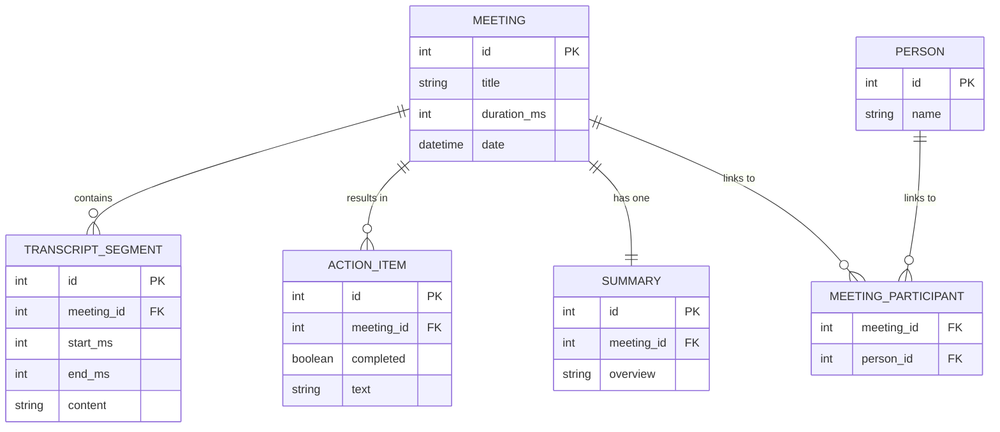

# Fireflies.ai Clone

A full-stack clone of the Fireflies.ai meeting-assistant web app.

## Tech Stack
- **Frontend**: Next.js (App Router), React, Tailwind CSS, shadcn/ui, TanStack Query, date-fns.
- **Backend**: Python 3.12, FastAPI, SQLAlchemy 2.0 (SQLite), Pydantic v2, Pytest.
- **Data**: Seeded automatically on startup with mock meetings, summaries, and action items.

## Local Setup

### Backend (FastAPI)
1. Navigate to `backend/`:
   ```bash
   cd backend
   ```
2. Create virtual environment and install dependencies:
   ```bash
   python -m venv .venv
   source .venv/Scripts/activate  # On Windows: .venv\Scripts\activate
   pip install -r requirements.txt
   ```
3. Run the dev server:
   ```bash
   uvicorn app.main:app --reload --port 8000
   ```
The SQLite database will automatically seed with mock data on the first run.
OpenAPI docs available at `http://localhost:8000/docs`.

### Frontend (Next.js)
1. Navigate to `frontend/`:
   ```bash
   cd frontend
   ```
2. Install dependencies:
   ```bash
   npm install
   ```
3. Run the dev server:
   ```bash
   npm run dev
   ```
The app will be available at `http://localhost:3000`.

## Architecture Overview
- **Monorepo**: Frontend and Backend in a single repository for easy evaluation.
- **Database**: SQLite stored in `backend/data/app.db`. Ephemeral nature is handled by automatic seeding on startup if the database is empty (ideal for Render free-tier).
- **API**: RESTful JSON API using FastAPI `APIRouter` under `/api/v1`.
- **State Management**: TanStack React Query for efficient fetching, caching, and optimistic updates.
- **Player Sync**: A custom `PlayerProvider` context drives a virtual timer (`currentMs`) that syncs the interactive transcript panel and notes playback to the selected timeline.

## Database Schema Diagram


## Features Completed
- **Meetings Library Dashboard**: View all meetings, sort (newest/oldest), filter by search text.
- **Meeting Detail**: Interactive synced transcript highlighting, dual-pane layout, FindBar for searching within transcript with visual highlights.
- **AI Notes**: Summary, Outline chapters, and Action Items.
- **Full CRUD**: Create a new meeting by pasting a transcript (the backend parses it and mocks summarization). Delete meetings, edit meeting details (metadata), and toggle/edit/add/delete action items inline.
- **Optimistic UI Updates**: Using React Query mutations.

## Assumptions & Mocks
- **Media**: Live recording bot / real-time speech-to-text is out of scope. We assume audio is pre-transcribed. Audio player is simulated via a virtual high-performance timer.
- **AI Backend**: Instead of calling a paid LLM, a heuristic mocking service deterministicly creates realistic summaries and action items from pasted transcripts for reliable, fast, zero-cost evaluation.
- **Auth**: Real authentication is skipped; a mock "Test User" is hardcoded.
- **Integrations**: External integrations (Zoom, Google Meet, etc.) are placeholders.
