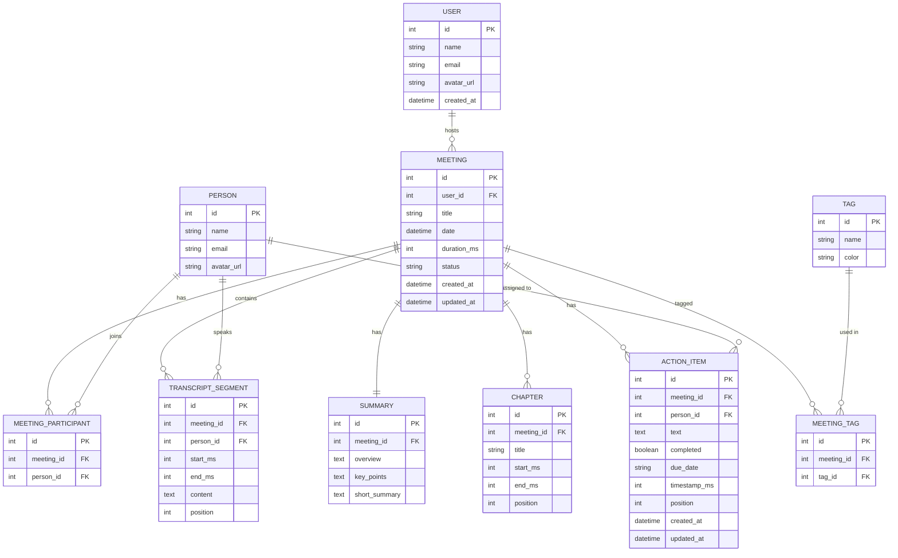

# plan.md — Fireflies.ai Clone (Meeting Notes & Transcription Platform)

> **Single source of truth.** Written so a brand-new AI session (or a very tired human) can resume exactly where work stopped.
>
> - **Deadline:** today, **8 Oct 2026, 8:00 AM local time** — public GitHub repo link + hosted demo link.
> - **State when this plan was written:** `frontend/` and `backend/` scaffolded with health endpoint + Next.js shell. Nothing else committed.
> - Items tagged _(verify)_ come from docs or memory that can change — re-check them when you reach them.

---

## 0. Resume protocol (read first)

### 0.1 Current status — update after every working session

| Field | Value |
|---|---|
| Current phase | Phase 2 — API: read endpoints + meeting list page (**in progress**) |
| Last completed step | 1.6 Commit Phase 1 (database models + seed data) |
| Next action | §9 → Phase 2 → step 2.1 |
| GitHub repo | _(fill in)_ |
| Live frontend (Vercel) | _(fill in)_ |
| Live backend (Render) | _(fill in)_ |
| Open questions / blockers | see §3.2 |

### 0.2 Prompt to paste into a new AI session

```text
I'm finishing a take-home assignment: a Fireflies.ai clone (Next.js + TypeScript frontend, FastAPI + SQLite backend).
Read plan.md in the repo root completely before doing anything — it is the source of truth.
Then:
1. Read §0.1 (status) and run `git log --oneline -20` to see what is really done.
2. Continue with the first unchecked item in §9. Do not redo finished work.
3. Treat §3.1 (locked decisions) as fixed; ask me before changing any of them.
4. Work in small vertical slices. After each slice: run it, run `pytest -q` (backend) or `npm run build` (frontend), commit, tick the box in §9 and update §0.1.
5. Keep code simple and readable — I must explain every line in an interview. After each slice, tell me what changed in 3 lines.
6. My deadline is 8:00 AM today. If time is short, follow §10 (cut line) instead of starting new features.
```

### 0.3 Working rules for any AI assistant on this repo

1. **Read this whole file before writing code.** §3.1 decisions are locked; ask before changing one.
2. **Small vertical slices.** Every slice ends with: app runs, local check passes (`pytest -q` / `npm run build`), commit, box ticked in §9, §0.1 updated.
3. **Simple, explainable code.** The owner must explain every line in an interview: no clever abstractions, no unused dependencies, no dead code, short functions, clear names.
4. **Original work only.** Do not copy from existing Fireflies clones or other repos. Do not put Fireflies' logo, images or screenshots in the repo.
5. **Never commit** secrets, `.env*`, `.venv/`, `node_modules/`, `.next/`, `*.db`.
6. **Do not invent UI.** Follow §8.1 (UI reference) and §8.2 (tokens). If unsure, ask the owner to check the real app.
7. **Time is the scarcest resource.** If behind, follow §10. Never start a new feature in the last 60 minutes.

---

## 1. Project snapshot

**Goal.** Build a functional clone of the Fireflies.ai meeting-assistant web app: a meetings library, an interactive transcript synced to a player, AI-style summary + action items + outline, full CRUD, and a Fireflies-like look and feel. Real speech-to-text and the live meeting bot are **out of scope** — transcripts are seeded, pasted or uploaded; summaries are mocked/generated.

**Deliverables (all mandatory)**
1. Public GitHub repo containing `frontend/` and `backend/`.
2. `README.md`: setup instructions, tech stack, architecture overview, database schema, API overview, assumptions.
3. A hosted, working demo URL. Submit both links.

**Assignment rules.** AI tools are allowed and encouraged, but the owner must understand and explain every line in an evaluation interview. Original work only (copying existing repos = immediate disqualification). The DB must be seeded so the app is usable immediately.

**Evaluation criteria.** Functionality · UI/UX similarity to Fireflies · Database design · Backend/API design · Code quality · Code modularity · Code understanding (interview).

---

## 2. Requirements and acceptance criteria

| ID | Requirement (from the assignment) | Done when |
|---|---|---|
| R1 | **Meetings library / dashboard.** List of past meetings with title, date, duration, participants. Search and filter (title, date, participant). Sort by recency. Navbar with profile/settings placeholders. | At least 6 seeded meetings on first load. Search matches title (and participant name) ~300 ms after typing. Participant + date-range filters combine (AND). Sort toggles newest/oldest. Filters live in the URL. Loading, empty and error states exist. |
| R2 | **Meeting detail.** Interactive transcript with speaker labels + timestamps. Media player with seek bar (placeholder OK). Click a line → player seeks; player time → highlights/scrolls the transcript. Search inside the transcript with highlighted matches. | Clicking any line moves the player there. Pressing play or dragging the seek bar highlights and scrolls to the active line. Find bar shows "n of m", highlights every match, Enter / Shift+Enter cycle through matches. |
| R3 | **AI summary and notes.** Summary, action items, key topics / outline / chapters (seeded, mocked or LLM). | Notes panel shows overview, key points, tags, action items and outline. Clicking a chapter or an action item's timestamp seeks the player. |
| R4 | **CRUD.** Create meeting (paste or upload transcript, or details-only form). Edit title + participants. Delete meeting. Add / edit / complete action items. Everything persists. | All three create paths work. Edit modal updates title/participants. Delete asks for confirmation and removes all child data. Action items: add, edit text/assignee/due date, toggle complete, delete. Refresh keeps changes. |
| R5 | **Fireflies experience.** Navigation + layout (library and detail), transcript and summary panels, forms/modals/search/filters, toasts, settings placeholders. | Sidebar + top bar on every page, two-panel meeting page, modals for create/edit/delete, a toast on every mutation (success and error), Settings page with "Coming soon" sections. |
| R6 | **Placeholders ("Coming soon" is enough).** Live bot, real speech-to-text, integrations (Zoom, Meet, calendar, CRM), team/sharing, real auth. | Visible and clearly marked; no dead or blank pages. A default user is always "logged in". |
| R7 | **Seed data.** Several meetings with full transcripts, summaries and action items. | Fresh DB → server start → data present automatically (also after every Render spin-down). |
| R8 | **Bonus (optional).** Comments / highlights / soundbites, export (PDF/MD/TXT), global search, tags + filter, LLM "ask this meeting", dark mode. | Only after R1–R7, the README and the deploy are finished. |

---

## 3. Decisions

### 3.1 Locked decisions

| Area | Decision | Why |
|---|---|---|
| Repo | One public GitHub repo (monorepo): `frontend/`, `backend/`, `README.md`, `plan.md` | Assignment requires it |
| Frontend | Next.js (App Router) + TypeScript, Tailwind CSS, shadcn/ui (Radix), lucide-react, TanStack Query, sonner (toasts), date-fns | Fast path to a polished Fireflies-like UI; every piece is standard and explainable |
| Backend | Python 3.12, FastAPI, SQLAlchemy 2.0 ORM, Pydantic v2, Uvicorn with 1 worker | Auto OpenAPI docs at `/docs`; typed schemas; 1 worker because SQLite |
| Database | SQLite file `backend/data/app.db` (git-ignored); tables via `Base.metadata.create_all`; **no Alembic** | SQLite is mandated; migrations are overkill for a one-night build (say so in the README) |
| API style | REST + JSON under `/api/v1`, snake_case fields, OpenAPI at `/docs` | Simple and easy to evaluate |
| Auth | None. One seeded default user (`id = 1`) is "logged in" | Assignment allows it |
| Transcription | No speech-to-text. Transcripts come from seed data, pasted text, or uploaded `.txt` / `.vtt` / `.json` | Assignment allows it |
| "AI" summaries | Deterministic mock summarizer (no API key) generates summary, action items, chapters and tags for pasted/uploaded transcripts. Optional LLM path behind an env var, **off by default** | Works offline and on the hosted demo at zero cost |
| Player | "Virtual clock" player (timer-driven) so seeking works across the whole meeting length; no media file needed | A short sample audio file would be shorter than the meeting and break seeking |
| Units | Integer **milliseconds** for every in-meeting time (`start_ms`, `end_ms`, `duration_ms`). Datetimes stored in UTC and serialized with a `Z` suffix | One unit avoids off-by-1000 bugs; `Z` avoids timezone shifts in the browser |
| IDs | Integer autoincrement primary keys | Clean URLs (`/meetings/3`), easy to explain |
| Hosting | Frontend on **Vercel** (Root Directory `frontend`). Backend on **Render** free Web Service (Root Directory `backend`). Both auto-deploy from `main` | Simplest free path for Next.js and Python |
| Cross-origin | Browser calls the Render API directly; `CORS_ORIGINS` on Render lists the Vercel production URL | Simple; no proxy layer |
| Package managers | npm (frontend); pip + venv with a hand-written `requirements.txt` (backend) | Fewest surprises on Vercel/Render |
| Dates | Store UTC; format in the viewer's timezone on the client only | Avoids SSR hydration mismatches |

### 3.2 Open decisions (recommended default in **bold**)

| Question | Recommendation |
|---|---|
| App name and logo | **"Fireflies Clone"** wordmark with your own simple SVG glow-dot mark — never Fireflies' own assets |
| Dark mode | **Skip** unless Phase 6 finishes early |
| LLM calls | **Off** (mock summarizer only) |
| Render region | **Oregon (US West)** — free-tier default _(verify)_ |

### 3.3 Hosting facts that shape the design _(verify at render.com/docs/free)_

- A Render **Free** web service spins down after **15 minutes without traffic** and can take up to about a minute to wake up. Render may also restart it at any time.
- Free services have an **ephemeral filesystem**: files (including a SQLite DB) are lost on every redeploy, restart **and spin-down**. So meetings a reviewer creates can vanish after 15 idle minutes.
- Free instance hours are capped per month (about 750; one always-awake service fits).
- **Consequences built into this plan:** (1) seed runs on every startup when the DB is empty; (2) the frontend retries failed requests and shows a "waking up the server" state; (3) optional UptimeRobot ping to `/health` every 5 minutes around evaluation time; (4) the README states this limitation plainly.

---

## 4. Architecture

### 4.1 Overview

```text
Browser ──(1) loads the UI──────────► Vercel: Next.js app (frontend/)
   │
   └──(2) fetch JSON over HTTPS (CORS)──► Render: FastAPI (backend/)
                                              routers → services → SQLAlchemy models
                                                                      │
                                                         SQLite file (ephemeral, seeded on startup)
```

### 4.2 Layers

**Backend**
- `routers/` — HTTP only: validate input, call a service, return a schema. No business logic.
- `services/` — business logic: meeting creation, transcript parsing, summarizing, search, export.
- `models/` (SQLAlchemy tables) and `schemas/` (Pydantic request/response models) are kept separate.
- `seed/` — JSON fixtures + loader. `database.py`, `config.py`, `main.py` — wiring.

**Frontend**: `app/` (routes) → `components/` (UI) → `hooks/` (data fetching + player logic) → `lib/` (API client, types, formatters).

### 4.3 Key flows

1. **Create from pasted transcript.** Modal → `POST /api/v1/meetings` → service: get-or-create people → parse transcript → insert segments → run summarizer → insert summary, chapters, action items, tags → return detail → toast + navigate to the meeting.
2. **Playback sync.** `PlayerProvider` owns `currentMs`. Transcript derives the active line by binary search on `start_ms`. Clicking a line, chapter or action-item timestamp calls `seek(ms)`; the seek bar does the same.
3. **Action item toggle.** Optimistic update in the TanStack Query cache → `PATCH /api/v1/action-items/{id}` → on error roll back + error toast.

### 4.4 Repository layout

```text
.
├── plan.md                         # this file
├── README.md                       # final deliverable doc (§12)
├── .gitignore
├── docs/
│   ├── samples/                    # sample.txt, sample.vtt, sample.json for testing upload
│   └── screenshots/                # used by README
├── backend/
│   ├── requirements.txt
│   ├── requirements-dev.txt        # pytest, httpx
│   ├── .env.example
│   ├── app/
│   │   ├── __init__.py
│   │   ├── main.py                 # app, CORS, lifespan (create tables + seed)
│   │   ├── config.py               # env settings
│   │   ├── database.py             # engine, SessionLocal, get_db, PRAGMA foreign_keys=ON
│   │   ├── models/                 # SQLAlchemy tables
│   │   ├── schemas/                # Pydantic models
│   │   ├── routers/                # meetings.py, action_items.py, lookups.py (me/people/tags), search.py, exports.py
│   │   ├── services/               # meeting_service.py, transcript_parser.py, summarizer.py, search_service.py, export_service.py
│   │   └── seed/                   # run.py + data/*.json
│   └── tests/
└── frontend/
    ├── package.json
    ├── .env.example                # NEXT_PUBLIC_API_URL
    ├── public/                     # favicon, logo.svg
    └── src/
        ├── app/                    # layout.tsx, providers.tsx, page.tsx (→ /meetings), meetings/, settings/, search/
        ├── components/
        │   ├── layout/             # AppShell, Sidebar, Topbar, ProfileMenu, NotificationsMenu
        │   ├── meetings/           # MeetingList, MeetingRow, FiltersBar, MeetingFormDialog, DeleteMeetingDialog
        │   ├── detail/             # MeetingHeader, PlayerPanel, SeekBar, TranscriptPanel, TranscriptRow, FindBar, NotesPanel, ActionItems, Outline
        │   ├── common/             # ComingSoon, EmptyState, AvatarStack, Skeletons
        │   └── ui/                 # shadcn/ui generated components
        ├── hooks/                  # usePlayer (PlayerProvider), useMeetings, useMeeting, useTranscript, useActionItemMutations, useDebounce
        └── lib/                    # api.ts, types.ts, format.ts, highlight.ts, utils.ts
```

---

## 5. Database schema

### 5.1 ER diagram



### 5.2 Table details

| Table | Key columns | Notes |
|---|---|---|
| `users` | id, name, email, avatar_url, created_at | One seeded default user (id=1). No real auth. |
| `meetings` | id, user_id FK, title, date (UTC), duration_ms, status (`completed`/`processing`), created_at, updated_at | `ON DELETE CASCADE` from user. `status` lets the UI show a spinner for upload-in-progress. |
| `people` | id, name, email (nullable), avatar_url (nullable) | Speakers and participants. Shared across meetings (get-or-create by name). |
| `meeting_participants` | id, meeting_id FK, person_id FK | Many-to-many join. `UNIQUE(meeting_id, person_id)`. |
| `transcript_segments` | id, meeting_id FK, person_id FK, start_ms, end_ms, content, position | `position` = 0-based ordering. Composite index on `(meeting_id, position)` for fast ordered fetches. |
| `summaries` | id, meeting_id FK (unique), overview, key_points, short_summary | One per meeting. `key_points` stored as JSON string (list of strings). |
| `chapters` | id, meeting_id FK, title, start_ms, end_ms, position | Outline / topic segments. `position` for order. |
| `action_items` | id, meeting_id FK, person_id FK (nullable), text, completed (bool), due_date (nullable), timestamp_ms (nullable), position, created_at, updated_at | `timestamp_ms` lets "click to seek". `person_id` is the assignee. |
| `tags` | id, name (unique), color | Get-or-create. A small set shared across all meetings. |
| `meeting_tags` | id, meeting_id FK, tag_id FK | Many-to-many. `UNIQUE(meeting_id, tag_id)`. |

### 5.3 Design rationale

- **`people` separate from `users`:** Speakers in a transcript are not necessarily app users. This avoids a bloated users table and makes the schema extensible if real auth were added.
- **No `transcript` table wrapping segments:** The meeting *is* the container. One fewer join.
- **`position` columns:** SQLite doesn't guarantee insert order. Explicit ordering is cheap and correct.
- **`summary.key_points` as JSON string:** Avoids another join table for a one-meeting list. Pydantic parses it on the way out.
- **Cascade deletes:** Deleting a meeting drops all child rows (segments, summary, chapters, action items, tags join).

---

## 6. API design

### 6.1 Endpoints

All under `/api/v1`. Request/response bodies are JSON, snake_case.

#### Meetings

| Method | Path | Body / Params | Returns | Notes |
|---|---|---|---|---|
| `GET` | `/meetings` | `?q=` `?participant=` `?date_from=` `?date_to=` `?tag=` `?sort=newest\|oldest` `?page=1` `?per_page=20` | `{ items: MeetingListItem[], total: int, page: int, per_page: int }` | Search runs LIKE on title + participant name. Filters AND. |
| `GET` | `/meetings/{id}` | — | `MeetingDetail` (includes participants, summary, chapters, tags) | Transcript NOT included — fetched separately for perf. |
| `POST` | `/meetings` | `{ title, date?, participants?: string[], transcript_text?, transcript_format?: "plain"\|"vtt"\|"json" }` | `MeetingDetail` | Parses transcript, runs mock summarizer, creates everything in one transaction. |
| `PATCH` | `/meetings/{id}` | `{ title?, participants?: string[] }` | `MeetingDetail` | Updates metadata only. Participants: full replace of the join rows. |
| `DELETE` | `/meetings/{id}` | — | `204 No Content` | Cascade deletes all child data. |

#### Transcript

| Method | Path | Body / Params | Returns | Notes |
|---|---|---|---|---|
| `GET` | `/meetings/{id}/transcript` | — | `{ segments: TranscriptSegment[] }` | Ordered by `position`. Includes speaker name. |

#### Action Items

| Method | Path | Body / Params | Returns | Notes |
|---|---|---|---|---|
| `GET` | `/meetings/{id}/action-items` | — | `ActionItem[]` | Ordered by position. |
| `POST` | `/meetings/{id}/action-items` | `{ text, assignee?, due_date?, timestamp_ms? }` | `ActionItem` | `assignee` is a person name (get-or-create). |
| `PATCH` | `/action-items/{id}` | `{ text?, assignee?, due_date?, completed?, timestamp_ms? }` | `ActionItem` | Partial update. |
| `DELETE` | `/action-items/{id}` | — | `204` | — |

#### Upload

| Method | Path | Body / Params | Returns | Notes |
|---|---|---|---|---|
| `POST` | `/meetings/upload` | Multipart: `file` (.txt/.vtt/.json) + `title` + `participants` (comma-separated) | `MeetingDetail` | Same pipeline as create-from-paste. |

#### Lookups

| Method | Path | Returns | Notes |
|---|---|---|---|
| `GET` | `/me` | `User` | Returns the default user (id=1). |
| `GET` | `/people` | `Person[]` | For participant autocomplete. |
| `GET` | `/tags` | `Tag[]` | For tag filter dropdown. |

#### Global search (bonus — Phase 8 only)

| Method | Path | Body / Params | Returns |
|---|---|---|---|
| `GET` | `/search` | `?q=` | `{ meetings: MeetingListItem[], segments: TranscriptSearchHit[] }` |

#### Export (bonus — Phase 8 only)

| Method | Path | Params | Returns |
|---|---|---|---|
| `GET` | `/meetings/{id}/export` | `?format=txt\|md\|json` | File download (`Content-Disposition: attachment`) |

#### Health

| Method | Path | Returns |
|---|---|---|
| `GET` | `/health` | `{ status: "ok" }` |

### 6.2 Pydantic schema naming convention

- `MeetingCreate` / `MeetingUpdate` — request bodies.
- `MeetingListItem` — slim response for the list (no transcript, no full summary).
- `MeetingDetail` — full response for the detail page.
- `TranscriptSegmentOut` — segment with speaker name attached.
- `ActionItemCreate` / `ActionItemUpdate` / `ActionItemOut` — CRUD.
- All schemas use `model_config = ConfigDict(from_attributes=True)`.

### 6.3 Error handling

- 404 on missing meeting/action item → `{ detail: "Meeting not found" }`.
- 422 on validation errors (Pydantic auto).
- 400 on bad file format → `{ detail: "Unsupported format. Use .txt, .vtt, or .json" }`.
- All error responses include `detail` string for frontend toast.

---

## 7. Seed data

### 7.1 Strategy

- **6 meetings** covering realistic scenarios:
  1. "Product Roadmap Planning" — 4 speakers, ~45 min, long transcript (~30 segments)
  2. "Sprint Retrospective" — 3 speakers, ~30 min
  3. "Customer Discovery: Acme Corp" — 2 speakers, ~25 min
  4. "Engineering Architecture Review" — 5 speakers, ~60 min
  5. "Weekly Team Standup" — 4 speakers, ~15 min (short)
  6. "Design Review: New Dashboard" — 3 speakers, ~35 min
- Each meeting has: participants, 15–40 transcript segments, a summary (overview + key_points), 3–6 chapters, 2–5 action items, 1–3 tags.
- Data lives in `backend/app/seed/data/meetings.json` — one JSON file, array of meeting objects.

### 7.2 Seed runner

`backend/app/seed/run.py`:
```python
def seed_if_empty(db: Session):
    """Called from main.py lifespan. Skips if any meeting exists."""
    if db.query(Meeting).first():
        return
    # 1. Create default user
    # 2. Load meetings.json
    # 3. For each meeting: get-or-create people, insert meeting,
    #    insert participants, segments, summary, chapters, action items,
    #    get-or-create tags, insert meeting_tags
    db.commit()
```

### 7.3 Timing values

- Segments have realistic `start_ms` / `end_ms` gaps (5–30 s per segment).
- `duration_ms` on the meeting = `max(end_ms)` of its segments.
- Action item `timestamp_ms` points to a real segment's `start_ms`.

---

## 8. UI specification

### 8.1 UI reference — Fireflies patterns to replicate

Study `app.fireflies.ai` before building. Key patterns:

| Page / Area | What to replicate |
|---|---|
| **Sidebar** | Fixed left sidebar, ~240 px. Logo at top. Nav items: Meetings (icon + label, active highlight), Settings. Collapsed state on mobile (hamburger). Profile avatar + name at bottom. Dark navy bg (`#1a1a2e`), slightly darker than content. |
| **Meetings library** | Top bar with search input (magnifying glass icon, placeholder "Search meetings…"). Filter chips / dropdowns (Participant, Date range, Tags). Sort toggle (calendar icon or text). Meeting cards/rows in a list: each shows title (bold), date + time, duration badge, participant avatars (stacked). Hover → subtle highlight. Click → navigate to detail. "New Meeting" CTA button (top right, primary color). |
| **Meeting detail — header** | Back button (← or breadcrumb). Meeting title (editable on click or via edit icon). Date + duration. Participant avatar stack. Edit and Delete icon buttons. |
| **Meeting detail — left panel (transcript + player)** | **Player bar** at top: play/pause button, current time / total time, seek bar (thin gradient or solid bar), playback speed (optional). **Transcript** below: scrollable list of lines. Each line: speaker avatar or initial, speaker name (colored), timestamp (muted, clickable), text. Active line highlighted (left border or bg tint). **Find bar** (Ctrl+F or click search icon): input + "n of m" + up/down arrows + close (Esc). Matches highlighted (yellow/amber bg in text). |
| **Meeting detail — right panel (notes)** | Tabbed or sectioned: **Summary** (Overview paragraph, Key Points list), **Action Items** (checkbox + text + assignee + due date; add button), **Outline / Chapters** (clickable list with timestamps). |
| **Create modal** | Dialog/modal. Title input, participants (multi-select or comma input), transcript textarea (paste) or file upload dropzone. Two clear paths: "Paste transcript" tab and "Upload file" tab. Submit button. |
| **Edit modal** | Prefilled title and participants. Save / Cancel. |
| **Delete confirmation** | Small dialog: "Are you sure? This will permanently delete…" Destructive-red confirm + Cancel. |
| **Toasts** | Bottom-right. Success = green, error = red. Auto-dismiss after 4 s. |
| **Settings page** | Same sidebar + top bar. Sections: Profile, Integrations, Notifications, Privacy — all with "Coming soon" badge. |
| **Empty states** | Friendly illustration or icon + "No meetings yet" + CTA. Same pattern for empty search results and empty action items. |

### 8.2 Design tokens

| Token | Value | Notes |
|---|---|---|
| Font family | `Inter` (body + headings) | Fireflies uses Inter. Load via `next/font/google`. |
| Font sizes | 12 / 13 / 14 / 16 / 18 / 24 px | Standard Tailwind `text-xs` through `text-2xl`. |
| Colors — brand | Primary: `#6C5CE7` (violet/purple). Accent: `#00D2D3` (teal). | Fireflies' primary is a purple-violet. |
| Colors — neutral | Sidebar bg: `#1a1a2e` (dark navy). Content bg: `#f8f9fa` (near-white). Card bg: `#ffffff`. Text primary: `#1e1e2e`. Text muted: `#6b7280`. Border: `#e5e7eb`. | Light theme only (skip dark mode). |
| Colors — semantic | Success: `#10b981`. Error/destructive: `#ef4444`. Warning: `#f59e0b`. Info: `#3b82f6`. | Standard Tailwind palette names. |
| Colors — speakers | Cycle through: `#6C5CE7`, `#00D2D3`, `#FD79A8`, `#FDCB6E`, `#55A3F8`, `#A29BFE` | 6 distinct speaker colors. Assign by `person_id % 6`. |
| Border radius | `rounded-lg` (8 px) for cards/modals, `rounded-md` (6 px) for inputs/buttons, `rounded-full` for avatars. | — |
| Spacing | 4 px grid (Tailwind default). Sidebar width: `w-60` (240 px). Content max-width: none (fluid). | — |
| Shadows | `shadow-sm` on cards, `shadow-lg` on modals/dropdowns. | — |
| Transitions | `transition-colors duration-150` on hovers. `transition-all duration-200` on modals. | Keep it snappy. |
| Active transcript line | Left border `border-l-3 border-primary` + `bg-primary/5`. | Subtle but visible. |
| Matched search text | `bg-amber-200/70` span wrapping matched text. Current match: `bg-amber-400`. | — |

### 8.3 Responsive breakpoints

| Breakpoint | Layout |
|---|---|
| `≥1024 px` (lg) | Sidebar visible + two-panel meeting detail (transcript left, notes right). |
| `768–1023 px` (md) | Sidebar collapsible (overlay). Meeting detail: tabs instead of side-by-side. |
| `<768 px` (sm) | Sidebar hidden (hamburger). Single column. Meeting detail: stacked tabs. |

---

## 9. Implementation phases — the checklist

> Tick each box (`- [x]`) as completed. Update §0.1 after every session.

### Phase 0 — Repo + skeleton + deploy

- [x] 0.1 Scaffold `backend/` (FastAPI app, config, database, health route, requirements.txt, .env.example) and `frontend/` (Next.js + Tailwind + shadcn/ui + TanStack Query + sonner, basic layout, providers, .env.example).
- [x] 0.2 Fix `.gitignore`: remove `plan.md` entry, add `*.pyc`, verify `data/` is ignored.
- [x] 0.3 Fix scaffold issues per §13 (remove `cn` and `radix-ui` packages, move `shadcn` to devDeps, swap Geist→Inter font, fix `LayoutProps` type, add `expire_on_commit=False` to sessionmaker).
- [x] 0.4 Push to GitHub (public repo). Fill in §0.1.
- [ ] 0.5 Deploy backend to Render (Free Web Service, Root Dir `backend`, Build `pip install -r requirements.txt`, Start `uvicorn app.main:app --host 0.0.0.0 --port $PORT --workers 1`). Verify `/health` returns OK.
- [ ] 0.6 Deploy frontend to Vercel (Root Dir `frontend`, set `NEXT_PUBLIC_API_URL` to Render URL). Verify page loads.

### Phase 1 — Database + seed + models

- [x] 1.1 Create SQLAlchemy models: `User`, `Meeting`, `Person`, `MeetingParticipant`, `TranscriptSegment`, `Summary`, `Chapter`, `ActionItem`, `Tag`, `MeetingTag`. All in `backend/app/models/`. Cascade deletes on meeting FK. Index on `(meeting_id, position)`.
- [x] 1.2 Create Pydantic schemas in `backend/app/schemas/`: request + response models per §6.2.
- [x] 1.3 Write seed data JSON (`backend/app/seed/data/meetings.json`) — 6 meetings, realistic transcripts, summaries, action items, chapters, tags.
- [x] 1.4 Write seed runner (`backend/app/seed/run.py`). Wire into `main.py` lifespan.
- [x] 1.5 Verify: `uvicorn app.main:app` → tables created, data seeded, `/docs` shows schemas. `pytest -q` passes.
- [x] 1.6 Commit: `feat: database models + seed data (6 meetings)`.

### Phase 2 — API: read endpoints + meeting list page

- [ ] 2.1 `GET /api/v1/meetings` — list with search, filters (participant, date_from, date_to, tag), sort, pagination.
- [ ] 2.2 `GET /api/v1/meetings/{id}` — full detail (participants, summary, chapters, tags, no transcript).
- [ ] 2.3 `GET /api/v1/meetings/{id}/transcript` — ordered segments with speaker name.
- [ ] 2.4 `GET /api/v1/me`, `GET /api/v1/people`, `GET /api/v1/tags` — lookups.
- [ ] 2.5 Backend tests: at least test list, detail, and 404.
- [ ] 2.6 Frontend: `lib/types.ts` — TypeScript types matching Pydantic schemas.
- [ ] 2.7 Frontend: `lib/api.ts` — extend with typed fetch functions (`getMeetings`, `getMeeting`, `getTranscript`, `getMe`, etc.).
- [ ] 2.8 Frontend: AppShell layout — Sidebar (logo, nav links, profile), Topbar (search, new meeting button). Apply to `layout.tsx` in `/meetings` route group.
- [ ] 2.9 Frontend: Meetings list page (`/meetings` = home) — `useMeetings` hook (TanStack Query), `MeetingList`, `MeetingRow` components, loading skeleton, empty state. Search + filters bar. URL-synced filters via `useSearchParams`.
- [ ] 2.10 Commit: `feat: meetings list API + dashboard UI`.

### Phase 3 — Meeting detail: transcript + player

- [ ] 3.1 Frontend: `PlayerProvider` context — state: `currentMs`, `isPlaying`, `playbackRate`, `durationMs`. Actions: `play`, `pause`, `togglePlay`, `seek(ms)`, `setRate`. Timer: `setInterval` at ~100 ms when playing, advances `currentMs`.
- [ ] 3.2 Frontend: `PlayerPanel` component — play/pause button, time display (`mm:ss / mm:ss`), SeekBar (range input or custom div), playback speed selector (0.5×, 1×, 1.5×, 2×).
- [ ] 3.3 Frontend: `TranscriptPanel` — fetch transcript via `useTranscript` hook. Render `TranscriptRow` list. Each row: speaker initial/avatar (colored), speaker name, timestamp (clickable → `seek`), content text. Active row: highlight (§8.2). Auto-scroll active row into view (`scrollIntoView({ block: 'nearest', behavior: 'smooth' })`).
- [ ] 3.4 Frontend: `FindBar` — Ctrl+F or click search icon opens bar. Input + "n of m" counter + ↑/↓ buttons + close (Esc). Highlight all matches with `<mark>`. Current match extra highlight. Enter = next, Shift+Enter = previous. Cycle at boundaries.
- [ ] 3.5 Frontend: Two-panel layout on meeting detail page (`/meetings/[id]`) — left (player + transcript), right (notes, placeholder for now). Responsive tabs on md/sm.
- [ ] 3.6 Commit: `feat: transcript player + search + two-panel layout`.

### Phase 4 — Notes panel: summary + chapters + action items

- [ ] 4.1 `GET /api/v1/meetings/{id}/action-items` endpoint.
- [ ] 4.2 Frontend: `NotesPanel` — tabbed or scrollable sections: Summary (overview + key points), Action Items, Outline (chapters).
- [ ] 4.3 Frontend: Summary section — render `overview` paragraph, `key_points` as bullet list, tags as colored badges.
- [ ] 4.4 Frontend: Outline/chapters section — list of chapter titles with timestamps. Click → `seek(start_ms)`.
- [ ] 4.5 Frontend: Action items section — list with checkbox, text, assignee name, due date. Click timestamp → `seek`. Toggling checkbox → optimistic update + `PATCH /api/v1/action-items/{id}`.
- [ ] 4.6 Commit: `feat: notes panel — summary, chapters, action items`.

### Phase 5 — CRUD

- [ ] 5.1 `POST /api/v1/meetings` — create with transcript text + parsing + mock summarizer.
- [ ] 5.2 `POST /api/v1/meetings/upload` — multipart file upload (.txt, .vtt, .json).
- [ ] 5.3 `PATCH /api/v1/meetings/{id}` — update title + participants.
- [ ] 5.4 `DELETE /api/v1/meetings/{id}` — cascade delete.
- [ ] 5.5 Action item CRUD: `POST /api/v1/meetings/{id}/action-items`, `PATCH /api/v1/action-items/{id}`, `DELETE /api/v1/action-items/{id}`.
- [ ] 5.6 Transcript parser service (`transcript_parser.py`): parse plain text (heuristic: `Speaker Name: text` or `[HH:MM:SS] Speaker: text`), `.vtt` (WebVTT format), `.json` (array of `{speaker, start_ms, end_ms, text}`).
- [ ] 5.7 Mock summarizer service (`summarizer.py`): deterministic. Extract first/last sentences for overview, extract questions for key points, extract sentences with "should"/"need to"/"will"/"action" for action items, split transcript into ~equal chunks for chapters, extract capitalized nouns for tags. No API key needed.
- [ ] 5.8 Backend tests: create, update, delete, upload.
- [ ] 5.9 Frontend: `MeetingFormDialog` — create modal with tabs: "Paste Transcript" (textarea), "Upload File" (dropzone), "Details Only" (just title + participants). Mutation via TanStack Query + toast.
- [ ] 5.10 Frontend: Edit modal — prefilled title + participants. Save triggers `PATCH`.
- [ ] 5.11 Frontend: Delete confirmation dialog — destructive button, toast on success.
- [ ] 5.12 Frontend: Action item add/edit inline — add button, inline edit on click, delete icon.
- [ ] 5.13 Commit: `feat: full CRUD — create, edit, delete meetings + action items`.

### Phase 6 — Polish + placeholders + settings

- [ ] 6.1 Settings page (`/settings`) — Profile, Integrations, Notifications, Privacy sections with "Coming soon" badges. Same AppShell layout.
- [ ] 6.2 "Coming soon" placeholders: Live Bot, Integrations, Team features — visible in sidebar or as disabled nav items with tooltip.
- [ ] 6.3 Error boundary: global fallback UI for unexpected errors.
- [ ] 6.4 "Waking up the server" state: if first API call takes >3 s, show a banner/toast explaining Render cold start.
- [ ] 6.5 Final UI pass: loading skeletons on all pages, empty states (no meetings, no results, no action items), consistent hover states, focus rings on all interactive elements.
- [ ] 6.6 Accessibility pass: all buttons have `aria-label`, images have `alt`, modals trap focus, Esc closes modals, tab order is logical.
- [ ] 6.7 Commit: `feat: settings, placeholders, polish`.

### Phase 7 — README + docs + final deploy

- [ ] 7.1 Write `README.md` per §12.
- [ ] 7.2 Create `docs/samples/` with sample upload files (sample.txt, sample.vtt, sample.json).
- [ ] 7.3 Take screenshots of key pages, save to `docs/screenshots/`. Reference in README.
- [ ] 7.4 Push to `main`. Verify both Vercel and Render auto-deploy and work.
- [ ] 7.5 Test the live demo end-to-end: load library, open a meeting, play transcript, search, create, edit, delete.
- [ ] 7.6 Final commit: `docs: README, screenshots, sample files`.
- [ ] 7.7 Fill in §0.1 with final URLs.

### Phase 8 — Bonus (only if time permits after Phase 7)

- [ ] 8.1 Export endpoint (`GET /meetings/{id}/export?format=txt|md|json`) + download button on meeting detail.
- [ ] 8.2 Global search page (`/search`) — searches across all meeting titles + transcript text.
- [ ] 8.3 Tags filter on dashboard — clickable tag badges.
- [ ] 8.4 Dark mode toggle (Tailwind `dark:` classes + CSS variable swap).
- [ ] 8.5 LLM "Ask this meeting" — optional, behind env var, calls OpenAI/Anthropic with transcript context.

---

## 10. Cut line — what to drop if behind schedule

> **Rule: never start a new feature in the last 60 minutes.** Use that time for README, deploy, and testing.

| Time remaining | What to do |
|---|---|
| **>4 hours** | Full plan. Work through phases in order. |
| **3–4 hours** | Skip Phase 8 (bonus). Focus on finishing Phase 6 + 7. |
| **2–3 hours** | Simplify Phase 5: skip file upload (keep paste-only create). Skip Phase 6.5/6.6 polish. Prioritize: working CRUD → Settings page → README → deploy. |
| **1–2 hours** | If Phase 4 is done: finish one create path (paste), skip edit/delete, rush README + deploy. If Phase 4 is NOT done: skip action item CRUD, hardcode notes, rush README + deploy. |
| **<1 hour** | STOP coding features. Write README from whatever works. Push. Deploy. Test live URL. Fix any deploy blocker. |

### Drop priority (last to cut → first to cut)

1. ✂️ **First cut:** Bonus features (Phase 8)
2. ✂️ **Second cut:** File upload (keep paste-only)
3. ✂️ **Third cut:** Transcript search (FindBar)
4. ✂️ **Fourth cut:** Edit/delete meeting (keep create-only)
5. ✂️ **Fifth cut:** Action item CRUD (keep read-only from seed)
6. ✂️ **Sixth cut:** Responsive mobile layout
7. ⚠️ **Never cut:** Seed data, meeting list, meeting detail with transcript+player sync, summary panel, README, working deploy

---

## 11. Testing strategy

### 11.1 Backend (pytest)

| Test file | What it covers |
|---|---|
| `tests/test_health.py` | Health endpoint returns 200 ✅ (already exists) |
| `tests/test_meetings.py` | List (default, search, filter, sort, pagination), detail (200 + 404), create (paste, upload), update, delete (cascade check) |
| `tests/test_action_items.py` | Create, update (toggle complete), delete, 404 on bad ID |
| `tests/test_seed.py` | Seed runs on empty DB, skips on populated DB, correct counts |

**Setup:** Use `TestClient` from `starlette.testclient` (sync) with an in-memory SQLite override. Each test gets a fresh DB via a pytest fixture.

```python
# tests/conftest.py (sketch)
import pytest
from sqlalchemy import create_engine
from sqlalchemy.orm import sessionmaker
from starlette.testclient import TestClient
from app.main import app
from app.database import Base, get_db

@pytest.fixture
def db():
    engine = create_engine("sqlite:///:memory:")
    Base.metadata.create_all(engine)
    Session = sessionmaker(bind=engine)
    session = Session()
    yield session
    session.close()

@pytest.fixture
def client(db):
    def override():
        yield db
    app.dependency_overrides[get_db] = override
    with TestClient(app) as c:
        yield c
    app.dependency_overrides.clear()
```

### 11.2 Frontend

- **`npm run build`** — catches TypeScript errors + Next.js build issues. This is the primary gate.
- **Manual testing checklist** (run through before final commit):
  - [ ] Library loads with 6 meetings
  - [ ] Search filters meetings in real time
  - [ ] Participant + date filters work
  - [ ] Click meeting → detail page loads
  - [ ] Player play/pause works, time advances
  - [ ] Click transcript line → player seeks
  - [ ] Player time → transcript scrolls + highlights
  - [ ] Ctrl+F → find bar → matches highlighted → navigate
  - [ ] Notes panel: summary, chapters (click seeks), action items (toggle works)
  - [ ] Create meeting (paste) → appears in library
  - [ ] Edit title → persists on refresh
  - [ ] Delete meeting → gone from library
  - [ ] Add action item → appears. Complete → checked. Delete → gone.
  - [ ] Settings page → "Coming soon" sections
  - [ ] Toast appears on every mutation
  - [ ] Empty state shows when search returns nothing
  - [ ] Refresh after any change → data persists

---

## 12. README.md template

> Copy this into `README.md` and fill in the blanks when completing Phase 7.

(See §12 in the artifact for the full template.)

---

## 13. Efficiency corrections to the scaffold

> Issues found in the existing scaffold (commit `fc210ab`) that should be fixed in Phase 0.3.

| # | Issue | Fix |
|---|---|---|
| 1 | **`plan.md` in `.gitignore`** — excludes the plan from the repo, but evaluators should see it. | Remove `plan.md` from `.gitignore`. |
| 2 | **Font mismatch** — scaffold uses `Geist` + `Geist_Mono`, but Fireflies uses `Inter`. | Replace with `Inter` from `next/font/google` in `layout.tsx`. |
| 3 | **`LayoutProps<"/">` type** — non-standard, may not exist in Next.js 16. | Change to `{ children: React.ReactNode }`. |
| 4 | **`cn` npm package** — redundant with `clsx` + `tailwind-merge` already installed (shadcn's `lib/utils.ts` defines `cn`). | Remove `cn` from `package.json`. |
| 5 | **`radix-ui` umbrella package** — very large, unnecessary when shadcn/ui installs individual `@radix-ui/*` packages. | Remove `radix-ui` from `package.json`. |
| 6 | **`shadcn` as runtime dependency** — it's a CLI tool, not imported at runtime. | Move to `devDependencies` or remove entirely (use `npx shadcn`). |
| 7 | **`expire_on_commit` not set** — after `db.commit()`, SQLAlchemy expires all attributes, causing extra SELECTs in the same request. | Add `expire_on_commit=False` to `sessionmaker()` in `database.py`. |
| 8 | **Render start command** needs `--workers 1` — SQLite is not safe for concurrent writes from multiple Uvicorn workers. | Add `--workers 1` to the start command. |
